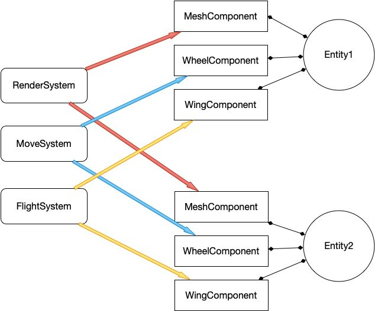

# TFrame

[](https://protocol.ai)
[](https://protocol.ai)
[](https://libp2p.io/)
[](https://webchat.freenode.net/?channels=%23libp2p)
[](https://codecov.io/gh/libp2p/go-reuseport)
[](https://travis-ci.org/libp2p/go-reuseport)
[](https://discuss.libp2p.io)

---
## 【TFrame Unity框架】

### (TFrame Unity)游戏设计网络框架使用C#开发，支持.NetFramework和Core版本，目前主要用于Unity3D，和控制台项目开发。扩展性强，支持新协议快速扩展，当前支持tcp，udp, kcp,  web网络协议。简易上手. api注释完整。

---

```Json
项目结构

Assets
├── Resources    // Resources目录
├── Scenes       // 场景
└── Scripts      // 脚本资源

Scripts
├── Core                // 基础框架
|   ├── 3rd             // 三方插件
|   ├── Common          // Common
|   ├── Editor          // Editor
|   ├── Event           // Event
|   ├── ECS             // ECS架构
├── Game                // 核心逻辑
|   ├── Actor           // 角色系统
|   ├── ActorName       // ActorName
|   ├── Bubble          // Bubble
|   ├── Camera          // Camera
|   ├── DataCenter      // 数据中心
|   ├── Proto           // 协议相关
|   └── UI              // UI
├── GameApp.cs          // 主入口
└── GameApp_RegisterSystem.cs      // 主入口注册系统
```
# 特点

## 1.ECS架构

### ECS架构类似unity的gameObject->component模式, 但是ECS是面向数据的编程思想，不同于面向对象以及Unity常用的Mono模式。Mono模式在内存中是散列的，而面向数据的ECS则是在内存中线性分布，且支持多线程（JobSystem、Brust编译）因此性能远高于原生Unity-Mono。可实现千人同屏。
### 在ECS中gameObject=entity, component=component, system类执行, ECS跟gameObject模式基本流程是一样的, 只是ecs中的组件可以复用, 而gameObject的component则不能复用, 在创建上万个对象时, gameObject就得重新new出来对象和组件, 而ecs调用Destroy时是把entity或component压入对象池, 等待下一次复用.实际上对象没有被释放,所以性能远高于gameObject的原因

 * E-- Entity 实体，本质上是存放组件的容器
 * C -- Component 组件，游戏所需的所有数据结构
 * S -- System 系统，根据组件数据处理逻辑状态的管理器
 * Component 组件只能存放数据，不能实现任何处理状态相关的函数
 * System系统不可以自己去记录维护任何状态
 * 说的通俗点，就是组件放数据，系统来处理。这么做的好处，就是为了尽可能地让数据与逻辑进行解耦
 * 一个良好的数据结构设计，也会以增加CPU缓存命中的形式来提升性能表现
 * 举个例子，常见的组件包括而不仅限于:
 * 渲染组件 ：模型的顶点、材质等数据，保证我们能正确地渲染到world中
 * 位置组件 ：记录着实体在这个world的真实位置
 * 特效组件 ：不同的时机，可能会需要播放不同的粒子特效以增强视觉感受




```Csharp
//例子
//ECS时间组件
public class TimerComponent : Component, IUpdate //继承IUpdate接口后就会每帧调用Update方法
{
    private DateTime dateTime;
    public override void Awake()
    {
        dateTime = DateTime.Now.AddSeconds(5);//在初始化时,把当前时间推到5秒后
    }
    public void Update()
    {
        if (DateTime.Now >= dateTime)//当5秒时间到, 则删除这个时间组件, 实际上是压入对象池
        {
            Destroy(this);
        }
    }
    public override void OnDestroy()//当销毁, 实际是压入对象池前调用一次
    {
    }
}

static void Main(string[] args)
{
    var entity = GSystem.Instance.Create<Entity>();//创建实体对象,这会在对象池中查询,如果对象池没有对象,则会new, 有则弹出entity
    entity.AddComponent<TimerComponent>();//添加时间组件,也是从对象池查询,没有则new, 有则弹出TimerComponent对象
    while (true)
    {
        Thread.Sleep(30);
        GSystem.Instance.Run();//每帧执行ecs系统
    }
}
```

## 2. Actor组合模式
### todo

---
## 3. 网络框架
## 3.1 golang帧同步
### 使用KCP，ProtoBuf做协议实现的帧同步框架，客户端同步随机数种子，保证随机数一致，实现了回滚帧，断线重连、心跳等等机制。稍微完善即可实现一款帧同步游戏。
## 3.2 golang状态同步
### 使用UDP同步位置，TCP作为常用包处理。//todo